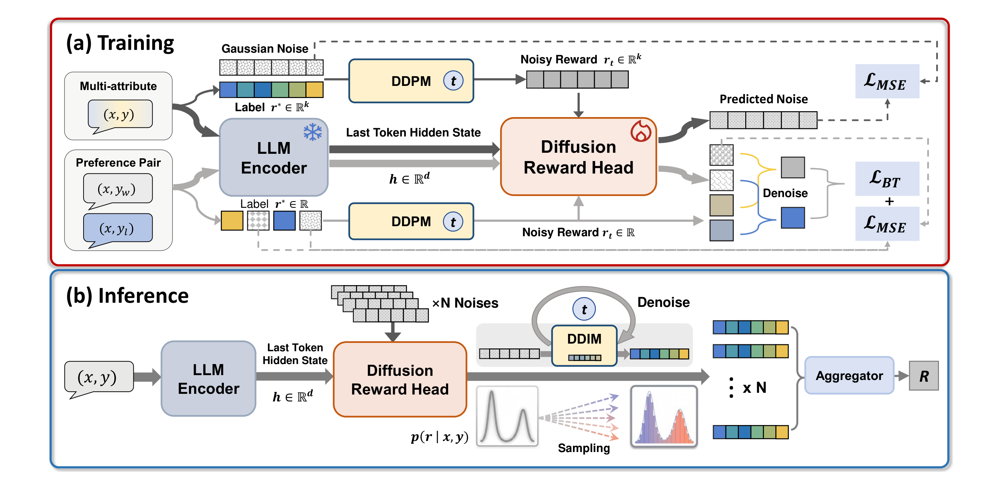
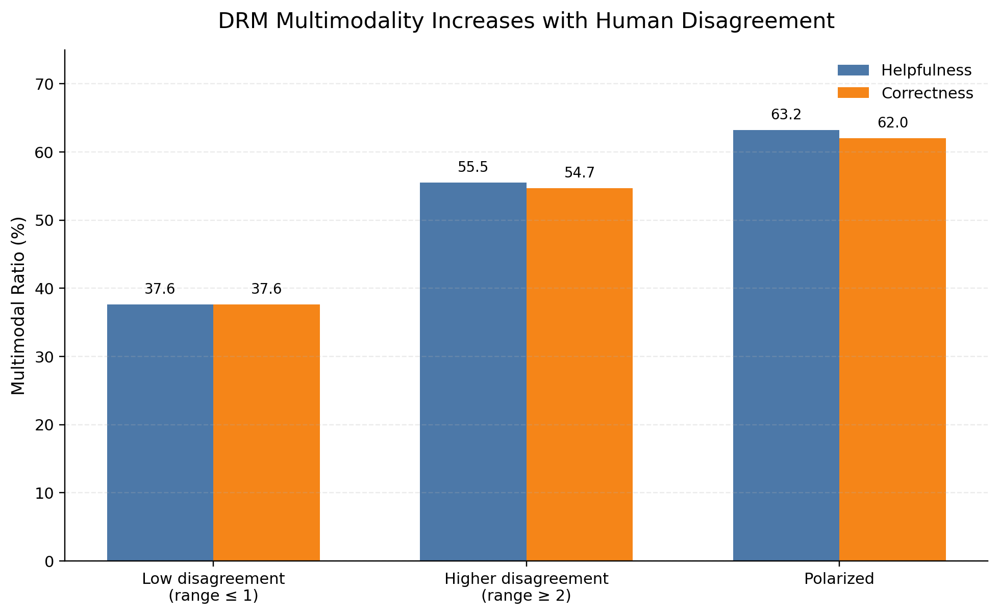
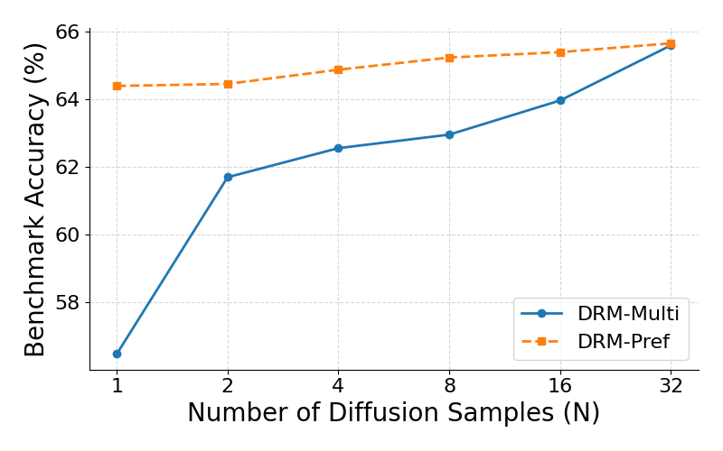

<div align="center">

## Diffusion Reward Models

[](https://huggingface.co/papers/2609.33803) [](https://github.com/thunlp/DRM) [](https://huggingface.co/Teburile/DRM)

</div>

<div align="center">
  <p>
    <a href="#-news"><b>🎉 News</b></a> •
    <a href="#-links"><b>🔗 Links</b></a> •
    <a href="#-introduction"><b>📖 Introduction</b></a> •
    <a href="#-getting-started"><b>✨ Getting Started</b></a>
  </p>
  <p>
    <a href="#-usage"><b>🔧 Usage</b></a> •
    <a href="#-evaluation"><b>📃 Evaluation</b></a> •
    <a href="#-citation"><b>🎈 Citation</b></a> •
    <a href="#-acknowledgement"><b>🌻 Acknowledgement</b></a>
  </p>
</div>

---

## 🎉 News

- **[2026-09]** DRM is released. The code and the DRM-Multi-8B and DRM-Pref-8B checkpoints are now available.

## 🔗 Links

- 📜 [Paper](https://huggingface.co/papers/2609.33803)
- 🤗 [DRM-Multi-8B and DRM-Pref-8B](https://huggingface.co/Teburile/DRM)
- 💻 [GitHub](https://github.com/thunlp/DRM)

## 📖 Introduction



Reward models underpin the alignment of large language models, yet dominant designs reduce each prompt–response pair to a point estimate or to a distribution from a fixed parametric family. This is at odds with human preference, which is inherently **multimodal** in the statistical sense: the same response can reasonably receive different judgments, and no single parametric family captures every pattern of disagreement.

**DRM** (Diffusion Reward Model) recasts reward modeling as conditional density estimation over `p(r | x, y)`. Conditioned on a frozen LLM encoder, a lightweight Diffusion Transformer denoises Gaussian noise into a reward vector, placing no parametric assumption on the output distribution. **DRM diffuses reward vectors, not text.**

- **One head, two supervision regimes:** multi-attribute regression with masked denoising and pairwise preference learning with a Bradley–Terry objective use the same architecture.
- **Distributional inference:** `N` samples form an empirical reward distribution that can provide a scalar score, uncertainty estimate, or risk-sensitive statistic.
- **Reward-axis test-time scaling:** drawing more samples can tighten the reward estimate without retraining.
- **A lightweight trainable head:** only the approximately 12M-parameter RewardDiT is trained; the 7.5B encoder remains frozen.

### How it works

During training, a frozen LLM encoder maps `(x, y)` to a hidden state `h`, and RewardDiT learns to denoise a reward vector conditioned on `h`:

- **DRM-Multi-8B** predicts 19 reward dimensions and uses a masked denoising loss over multi-attribute labels.
- **DRM-Pref-8B** predicts one reward dimension and combines denoising with a Bradley–Terry objective over pairwise preferences.

At inference time, DRM draws `N` reward vectors with DDIM. The released defaults are 10 sampling steps, guidance scale 7, and `N=32`.

## 🔍 Key Findings

- **The diffusion head improves matched-data performance.** With the same training data and FsfairX backbone, DRM-Multi-8B reaches a **66.2** average across six metrics, compared with **62.3** for ArmoRM.
- **Human disagreement has structure, and DRM tracks it.** DRM's multimodal-output ratio rises with the level of disagreement in repeated annotations.
- **A small number of denoising steps is sufficient.** Ten DDIM steps work well for low-dimensional rewards; increasing the count to 50–100 degrades ranking accuracy.



## ✨ Getting Started

### Environment setup

```bash
git clone https://github.com/thunlp/DRM.git
cd DRM

conda create -n drm python=3.10
conda activate drm
pip install -r requirements.txt
```

FlashAttention is optional. Without it, the data-preparation scripts fall back to PyTorch SDPA on CUDA or eager attention on CPU.

### Download checkpoints

```bash
hf download Teburile/DRM DRM-Multi-8B/model.pth --local-dir checkpoints
hf download Teburile/DRM DRM-Pref-8B/model.pth --local-dir checkpoints
```

This creates `checkpoints/DRM-Multi-8B/model.pth` and `checkpoints/DRM-Pref-8B/model.pth`.

### Data preparation

Text is encoded with `sfairXC/FsfairX-LLaMA3-RM-v0.1` by default. Use `--limit 0` to process the full dataset.

```bash
# Multi-attribute data (ArmoRM, 19 dimensions)
python prepare_armorm_data.py \
  --output_root data/armo_dataset \
  --limit 0 \
  --max_length 4096

# Pairwise-preference data (Tulu3)
python prepare_tulu3_pair_data.py \
  --output_root data/armo_dataset \
  --dataset_split all \
  --limit 0 \
  --max_length 4096
```

### Training

```bash
# DRM-Multi-8B: masked denoising over 19 reward dimensions
python train_dit_armorm.py \
  --data_root data/armo_dataset \
  --output_dir outputs/dit_armorm

# DRM-Pref-8B: denoising plus Bradley–Terry preference learning
python train_dit_tulu3_pair.py \
  --data_root data/armo_dataset \
  --output_dir outputs/dit_tulu3_pair
```

All experiments were conducted on NVIDIA A800-SXM4-80GB GPUs. Reward-head training takes approximately 1.54 GPU-hours in total, excluding one-time frozen-encoder embedding generation.

## 🔧 Usage

Score a prompt–response pair with either released checkpoint:

```bash
# DRM-Multi-8B
python score_generator.py \
  --ckpt checkpoints/DRM-Multi-8B/model.pth \
  --prompt "User prompt" \
  --response "Assistant response"

# DRM-Pref-8B
python score_generator.py \
  --ckpt checkpoints/DRM-Pref-8B/model.pth \
  --prompt "User prompt" \
  --response "Assistant response"
```

The scorer defaults to 10 DDIM steps, guidance scale 7, and 32 reward samples. It averages over samples and then over reward dimensions to return one scalar per input.

## 📃 Evaluation

The table reports results across five benchmarks and six metrics. For ArmoRM, QRM, URM, and DRM-Multi-8B, the training data and FsfairX backbone are matched; only the reward head differs.

| Reward Model | RewardBench v2 | PPE Pref | PPE Corr | RMB Pairwise | RM-Bench | JudgeBench | Avg. |
|---|---:|---:|---:|---:|---:|---:|---:|
| ArmoRM-Llama3-8B-v0.1 | **66.5** | 60.6 | 61.4 | 64.6 | 67.7 | 53.2 | 62.3 |
| QRM-Llama3.1-8B-v2 | 70.7 | 57.2 | 60.3 | 61.1 | 72.5 | 62.6 | 64.1 |
| URM-LLaMa-3.1-8B | 73.9 | 60.2 | 60.4 | 65.7 | 72.0 | 64.1 | 66.1 |
| **DRM-Multi-8B** | 65.6 | 62.5 | 63.8 | **78.0** | 68.8 | 58.6 | **66.2** |
| **DRM-Pref-8B** | 65.7 | 63.0 | 62.5 | **78.2** | 68.1 | 57.1 | 65.8 |

DRM-Multi-8B improves the six-metric average by **3.9 points over ArmoRM** and performs on par with parametric distributional heads without assuming an output family. It does not lead on every benchmark: for example, its RewardBench v2 score is 65.6, compared with 66.5 for ArmoRM.



Increasing the number of reward samples raises DRM-Multi-8B from 56.5 at `N=1` to 65.6 at `N=32` on RewardBench v2. The learned distribution can also support uncertainty-aware rejection and risk-sensitive aggregation.

## 🎈 Citation

If you find DRM useful, please cite our work:

```bibtex
@misc{wang2026diffusionrewardmodels,
      title={Diffusion Reward Models}, 
      author={Xiangyang Wang and Bingxiang He and Zeyuan Liu and Jiaze WangZiqing Qiao and Yuxin Zuo and Huan-ang Gao and Cheng Qian and Wenbin Zhang and Ran Li and Youbang Sun and Ning Ding and Yuanchun Shi and Zhiyuan Liu and Chaojun Xiao and Chun Yu},
      year={2026},
      eprint={2609.33803},
      archivePrefix={arXiv},
      primaryClass={cs.LG},
      url={https://arxiv.org/abs/2609.33803}, 
}
```

## 🌻 Acknowledgement

DRM builds on the frozen encoder from [FsfairX-LLaMA3-RM-v0.1](https://huggingface.co/sfairXC/FsfairX-LLaMA3-RM-v0.1) and uses [Diffusers](https://github.com/huggingface/diffusers) for DDIM sampling. Training data comes from the ArmoRM and Tulu3 preference corpora. We thank these projects for their open-source contributions.

